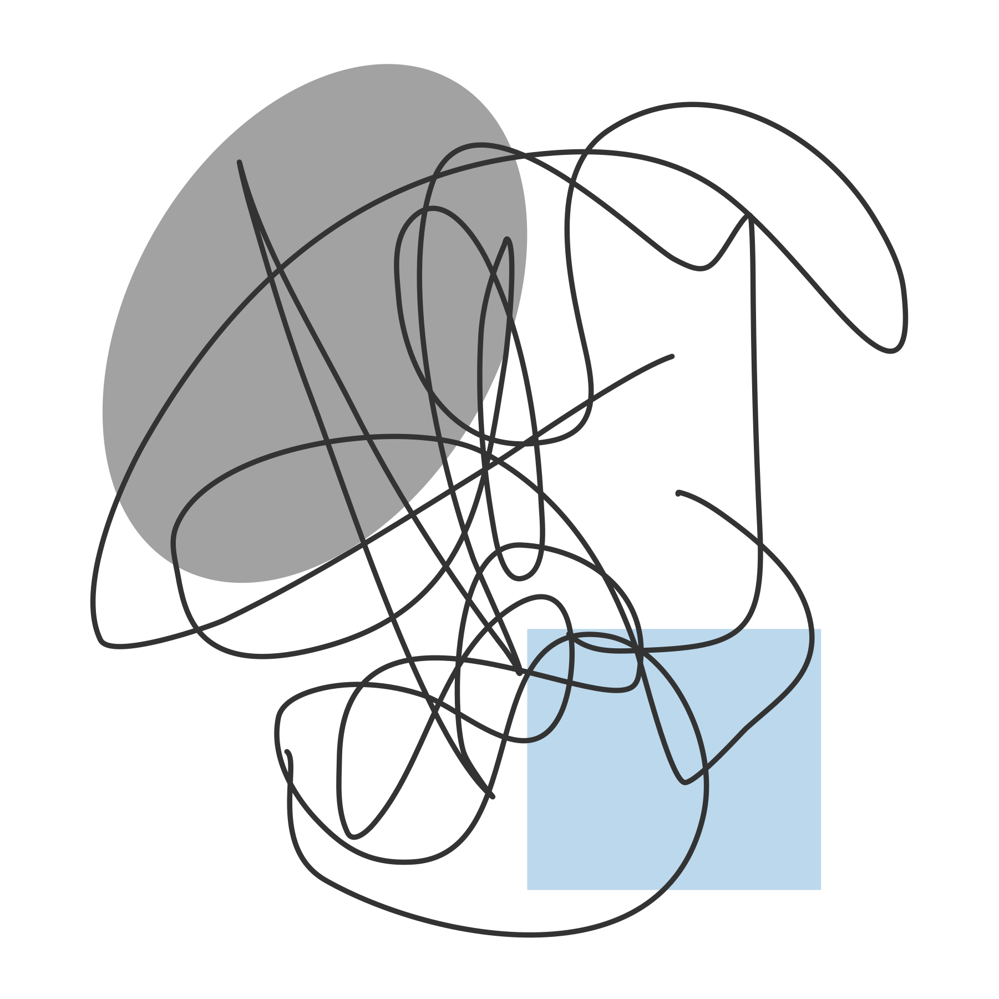

> This is a template python package that includes:
> -  A `pyproject.toml` file using [poetry](https://python-poetry.org/)
> - A [ReadTheDoc](https://readthedocs.org/) online documentation
> - A simple config file system with a `~/.pythonpackage` config folder


# pythonpackage

<p align="center" style="margin-bottom:0px">
    
</p>

<p align="center">
  Description
  <br>
  <p align="center">
    <a href="https://github.com/lgrcia/pythonpackage">
      
    </a>
    <a href="LICENCE">
      
    </a>
    <a href="https://pythonpackage.readthedocs.io">
      
    </a>
  </p>
</p>

 *pythonpackage* is a Python package to ...

 Lorem ipsum dolor sit amet, consectetur adipiscing elit, sed do eiusmod tempor incididunt ut labore et dolore magna aliqua. Ut enim ad minim veniam, quis nostrud exercitation ullamco laboris nisi ut aliquip ex ea commodo consequat. Duis aute irure dolor in reprehenderit in voluptate velit esse cillum dolore eu fugiat nulla pariatur. Excepteur sint occaecat cupidatat non proident, sunt in culpa qui officia deserunt mollit anim id est laborum.

## Example

## Installation

From the github repo

```shell
pip install 'pythonpackage @ git+https://github.com/lgrcia/pythonpackage'
```